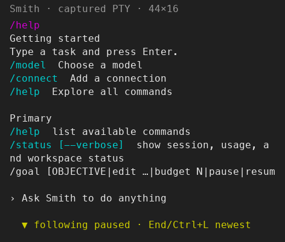
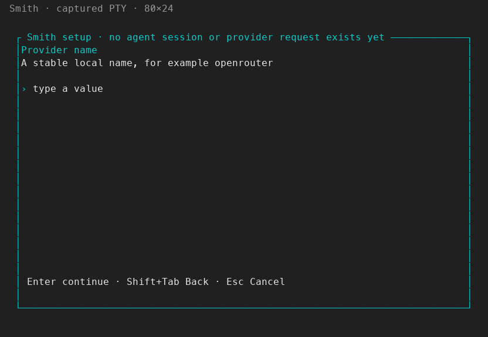
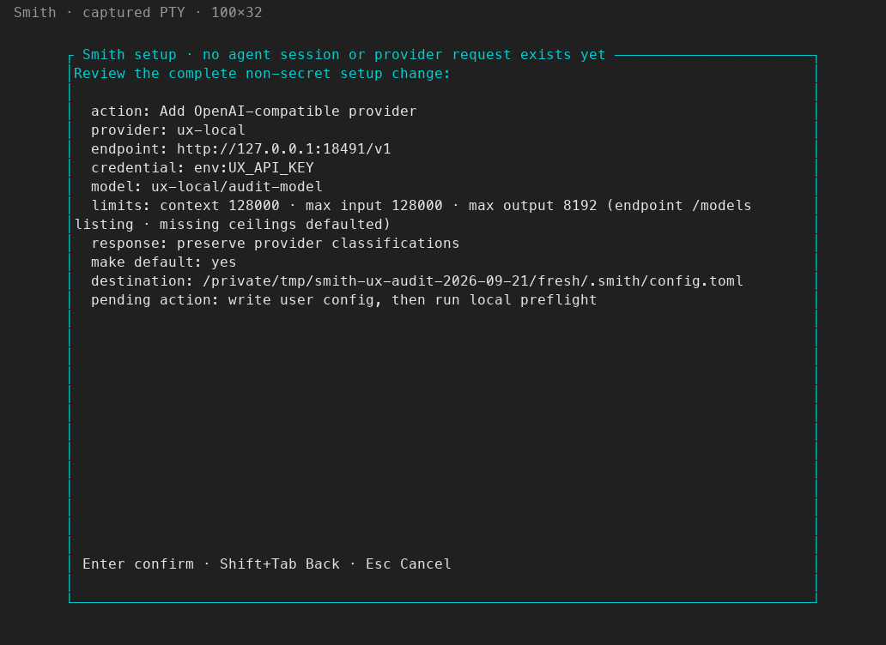
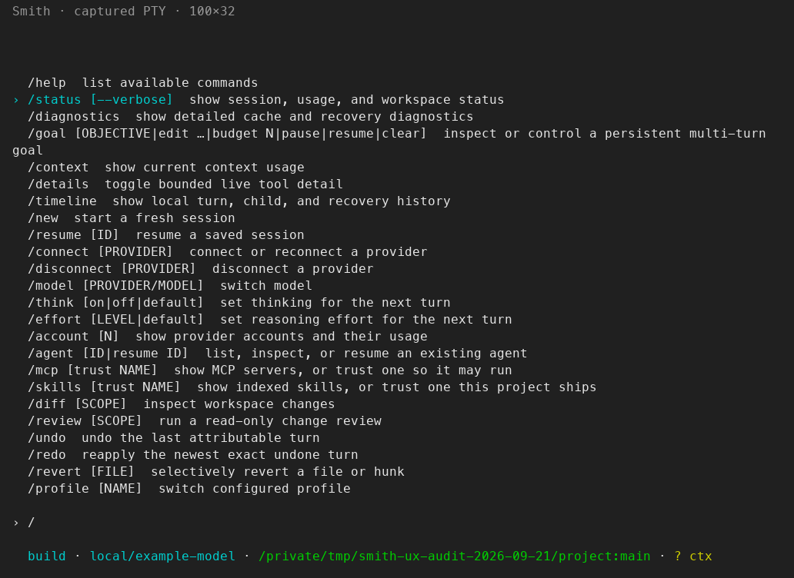
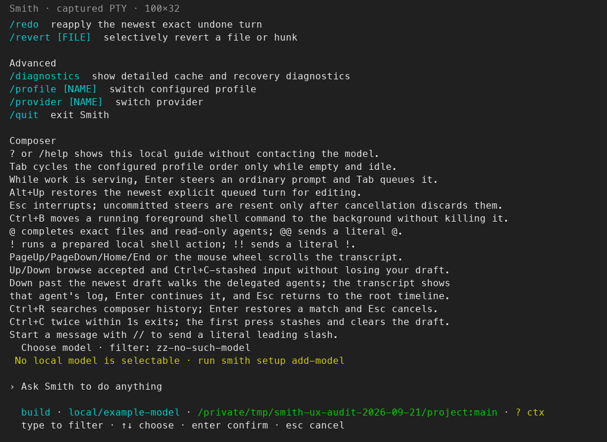

# Smith feature and UX audit — 2026-09-21

Priority: getting started, setup, connections, model selection, and commands.

**Result:** implemented and verified the eight startup issues below after
approval of
[improve-starting-work-ux](../../spec/changes/improve-starting-work-ux-2026-09-21/proposal.md).
Setup corrections preserve non-secret values, new sessions explain where to
start, help opens at its beginning, command selection works, and resource
pickers keep state and recovery controls visible. Existing custom-provider and
automatic model-limit work remains intact.

Final checks: **1,653 workspace tests passed, 0 failed, 6 ignored**; **222 runtime
conformance tests passed**; **40 startup PTY checks and 26 command smoke checks
passed**. Formatting and strict Clippy are clean. This is a verified local
implementation; it has not been committed, published, or deployed.

## Implemented and visually checked

| Change | Result | Evidence |
| --- | --- | --- |
| Empty-session guide | Pass; transient guidance, no transcript history | [100×32](50-startup-100x32-after.png), [44×16](50-startup-44x16-after.png) |
| Help begins at the new result | Pass after existing conversation; scrolling and Ctrl+L retain their behavior | [100×32](53-help-start-100x32-after.png), [44×16](53-help-start-44x16-after.png) |
| Highlighted Enter and five-row command menu | Pass; exact arguments, busy guards, history and Tab completion covered by regressions | [Selected status](51-command-selected-100x32-after.png), [Executed status](52-highlighted-status-100x32-after.png) |
| Description search | Pass; `switch` offers model, profile and provider, and Enter opens the selected picker | [44×16](58-command-intent-44x16-after.png) |
| Filter miss and Ctrl+U recovery | Pass; no false setup instruction, clearing stays in the picker | [No matches](56-model-no-matches-44x16-after.png), [Cleared](57-model-filter-cleared-44x16-after.png) |
| Current/unavailable state before metadata | Pass; disabled entries remain non-selectable | [80×24](55-model-picker-80x24-after.png), [44×16](55-model-picker-44x16-after.png) |
| Narrow action hints | Pass; Enter/choose and Esc/cancel visible, including no-color | [No-color picker](61-picker-no-color-after.png) |
| Setup Back retains non-secret fields | Pass; provider and endpoint inspected under PTY; model/context and secret clearing covered by tests | [Endpoint](62-back-retains-endpoint-after.png), [Provider](63-back-retains-provider-after.png) |

Three Luna Max agents implemented the independent command, picker, and setup
changes. Sol reviewed the implementation. Its help-anchor edge-case finding
was fixed and covered by a regression. The primary agent integrated the changes,
ran the real binary, and inspected the rendered terminal captures.

## Evidence and scope

Tested commit `2eea965` plus the current working tree, including the pre-existing uncommitted custom
provider and automatic model-limit changes. The baseline `cargo test --workspace`
passed **1,637 tests across 35 test binaries/doc-test groups, with 0 failures**.
Six tests were ignored: four external-service tests and two documentation examples.

Interactive checks run the real `target/debug/smith` binary under a PTY with an
isolated home, fake providers, and a disposable Git project. Captures named
`captured PTY` visualize the actual ANSI terminal cells using a fixed palette;
they are not desktop screenshots and do not prove native font/clipboard behavior.
The native cmux first-run capture is retained in the temporary audit directory
outside this repository because it includes unrelated desktop/sidebar content.
No real credentials or user sessions are changed. Live provider entitlement/OAuth and external MCP services
are not verified by the offline suite.

Both baseline and final PTY sweeps passed **26 command/result checks**, exercising local
commands, selector entry points, a prompt, and model/profile changes. These
checks establish expected local output. A separate final startup walkthrough
passed **40 checks**, including highlighted menu activation, help, filtering,
no-color, and backward setup navigation. A real loopback HTTP server
also completed custom-provider setup and a streamed first response before and
after the changes. Its final request
log records exactly one `GET /v1/models` during setup and one
`POST /v1/chat/completions` after the prompt. See
[startup checks](startup-ux-checks-after.json),
[command checks](command-sweep-after.json), and
[endpoint requests](custom-endpoint-requests-after.json).

## Checklist

`Automated` means covered by tests run in this audit, not a claim of a manual or
live-service pass. PTY outcomes and remaining gaps are recorded separately.

| # | Feature/workflow | Baseline | Interactive result / remaining check |
| --- | --- | --- | --- |
| 1 | Empty-install startup and setup cancellation | Automated pass | Native/PTY captured; provider choices work; presentation is dense |
| 2 | Built-in provider setup | Automated pass | External account sign-in and entitlement unverified |
| 3 | Custom OpenAI-compatible connection | Automated + PTY pass | Full loopback endpoint setup → review → chat → streamed answer passed |
| 4 | Automatic model limits and fallback input | Automated + PTY pass | Published 128k window discovered; missing metadata asks only for context; 0 rejected and 64k accepted |
| 5 | Masked credentials, storage choice, review, rollback | Automated pass | Real OS credential prompts unverified |
| 6 | Add model and switch defaults | Automated pass | Process-level add-model/add-provider tests passed; custom first-run default applied |
| 7 | First chat screen / start a task | Automated pass | Fixed + PTY pass: starting guide connects task entry, model choice, connection and help |
| 8 | Slash completion and Ctrl+P | Regression found | Fixed + PTY pass: highlighted Enter executes; menu stays at five rows; intent search works |
| 9 | Help and keyboard guide | Automated pass | Fixed + PTY pass: starts at the new result, with complete reference still scrollable |
| 10 | Model selection and filtering | Automated pass | Fixed + PTY pass: clear no-match recovery and visible current/unavailable state |
| 11 | Provider selection and model cascade | Automated + PTY pass | `/provider other` applies `other/alternative-model`; explicit model switch preserves conversation |
| 12 | Profiles and idle Tab cycling | Automated + PTY pass | `/profile plan` and idle Tab both apply plan posture/model; conversation preserved |
| 13 | Connect/reconnect/disconnect | Automated + PTY pass | Pickers, custom setup handoff and cancel-to-original-session passed; real login not attempted |
| 14 | Thinking and reasoning effort | Automated + PTY pass | Unsupported fake-provider controls explain their unavailable state |
| 15 | Account pools and rotation | Automated pass | Live account limits/rotation unverified |
| 16 | Status, diagnostics, context and usage | Automated + PTY pass | All three local commands render; long non-help results retain their existing tail-first behavior |
| 17 | Chat streaming and tool continuation | Automated + PTY pass | Fake prompt and loopback HTTP stream passed; real provider entitlement unverified |
| 18 | Composer editing, multiline paste and history | Automated + PTY pass | Up recalls the command and Down restores `scratch draft`; native clipboard/image capture unverified |
| 19 | File mentions and attachments | Automated + PTY pass | `@` → README filter → Enter inserts `@README.md`; missing/ambiguous files and attachment identity covered deterministically |
| 20 | Read/list/search/edit/shell and bounded output | Automated + PTY pass | Foreground shell explicitly approved and expected output observed |
| 21 | Approvals, questionnaires and prompt queues | Automated + PTY pass | Shell prompt shows authority and keys; allow-once works; questionnaires covered deterministically |
| 22 | Steering, queued prompts and interruption | Automated pass | Deterministic coverage; live-provider timing unverified |
| 23 | Background shells, output, stopping and exit | Automated pass | Four dedicated background-task tests passed; foreground shell and idle exit also checked under PTY |
| 24 | Agent profiles, child inspection, follow-up and resume | Automated pass | Fake/deterministic coverage; live multi-agent operation unverified |
| 25 | Goals and continuation controls | Automated + PTY pass | `/goal` local status works; automatic continuation covered deterministically |
| 26 | New, list, select and resume sessions | Automated + PTY pass | Fresh session, resume picker and exit/resume instruction passed; resume execution covered by existing PTY test |
| 27 | Persistence, checkpoints and recovery | Automated pass | Offline recovery scenarios passed |
| 28 | Diff scopes and read-only review | Automated + PTY pass | Empty workspace diff/review are local, readable outcomes; nonempty scopes covered by tests |
| 29 | Undo, redo and selective revert | Automated + PTY pass | Empty/no-attribution cases fail locally; mutation/rollback scenarios covered deterministically |
| 30 | MCP discovery and trust | Automated + PTY pass | `/mcp` renders locally; two real-server integration tests remain ignored |
| 31 | Skill discovery and trust | Automated + PTY pass | `/skills` renders inventory; trust and precedence covered deterministically |
| 32 | Installed CLI agents and command-jsonl providers | Automated pass | PTY integration exists in suite; actual external CLIs not invoked |
| 33 | Headless text, JSON, JSONL and exit contracts | Automated pass | Existing process-level tests passed |
| 34 | Narrow terminals, no color, resizing and terminal restoration | Regression found | Fixed + PTY pass: action hints visible at 44 columns; 100×32, 80×24, 44×16 and no-color inspected; size warning/restoration covered |
| 35 | Installer, package and distribution smoke checks | Pass | JS syntax, all seven Node tests, two isolated Linux installer fixtures, and npm pack dry run passed |

## Baseline startup issues — all eight addressed above

1. **No first-use orientation.** A configured new session is almost entirely
   blank. Only the composer placeholder and an abbreviated identity footer
   explain where the user is. See `02-empty-session-before.png`.
2. **Help opens at the wrong end.** At 100×32, invoking `/help` shows the end of
   the command list and keyboard reference; `/connect`, `/model`, and `/resume`
   are above the viewport. See `03-help-before.png`.
3. **Search failure gives the wrong recovery action.** Filtering existing models
   to `zz-no-such-model` says “No local model is selectable · run smith setup
   add-model.” Clearing/changing the search is the appropriate next step.
   See `05-model-filter-before.png`.
4. **Picker state loses to metadata.** The `current` and `unavailable` suffixes
   follow lengthy limits/provenance, so ordinary terminal widths can hide them.
   See `04-model-picker-before.png`.
5. **Command discovery requires knowing command names.** Searching `switch` in
   Ctrl+P finds nothing even though three commands describe switching. See
   `07-palette-search-before.png`.
6. **Highlighted commands do not run.** Type `/`, move to `/status`, and press
   Enter: the menu remains open. The error is itself off-screen because the
   command menu uses nearly the entire transcript instead of five rows. See
   `13-palette-status-selected.png` and `14-palette-enter-before.png`.
7. **Setup Back clears previous values.** Shift+Tab from an invalid endpoint
   returns to an empty provider-name field, although that name was accepted
   on the previous step. This forces users to re-enter it rather than edit it.
   See `35a-back-loses-provider.png`.
8. **Narrow pickers lose the action hint.** At 44×16 the model picker has no
   visible Enter/Escape instructions. The footer truncation drops the whole
   long hint span instead of retaining its essential controls. See
   `34-model-44x16-before.png`.

## Priorities and implementation targets

| Priority | Change | Source / acceptance |
| --- | --- | --- |
| P1 | Execute the highlighted completion and cap visible rows | `app/input.rs` and `render/modal.rs`; `/` → Down → Enter opens status |
| P1 | Retain non-secret setup fields on Back | `setup.rs`; correcting the URL does not erase the provider name |
| P2 | Differentiate no search matches from no configured resources | `picker.rs`; a typo offers filter recovery, not setup |
| P2 | Keep current/unavailable state and action keys visible | `picker.rs`, `render/composer.rs`; verify at 100, 80 and 44 columns |
| P2 | Orient a new session and open help from its beginning | `render/transcript.rs`, `app/resources.rs`, `render/layout.rs` |
| P2 | Match command descriptions after name-prefix matching | `commands.rs`; `switch` finds model, profile and provider choices |

All source paths in this table are relative to `crates/smith-tui/src/`.
The proposal preserves credential handling, approvals, configuration layering,
and provider requests. It is a focused first pass, not a claim to resolve all
design debt across agents, recovery, and advanced diagnostics.

## Baseline starting-work walkthrough

1. **Select provider — works, dense.** Fresh setup exposes the available paths.
   [Capture](08-setup-provider.png).
2. **Enter connection — works, correction is awkward.** Invalid URLs stay local;
   Back erases the accepted provider name.
   
3. **Resolve model window — works.** The loopback endpoint provides the window;
   the unknown-model path asks for one positive context value.
   [Discovered](21-discovered-limits.png) · [Fallback](36-manual-window.png).
4. **Review and save — works.** Destination, model limits, and credential method
   are shown before writing; cancellation in the fallback flow writes nothing.
   
5. **Start a task — works, orientation missing.** Setup enters chat and a first
   prompt receives a streamed response. Before typing, the surface is mostly empty.
   [Empty session](02-empty-session-before.png) · [Response](24-custom-first-response.png).
6. **Find a command — fails through menu selection.** Typed commands work, but
   selecting `/status` with arrows and Enter does not execute it.
   
7. **Choose a model — works, misleading state.** Model/provider pairs apply
   correctly, but metadata hides `current` and a filter miss suggests adding a model.
   
8. **Get help — content complete, entry position poor.** Help initially shows
   its tail, hiding startup commands. [Capture](03-help-before.png).

## Quality gates

Environment: macOS, Rust/Cargo 1.97.1. This is not a full macOS/Linux release
matrix or a pinned Rust 1.88 conformance run.

| Command | Outcome |
| --- | --- |
| `cargo test --workspace --locked` | Final: 1,653 passed, 0 failed, 6 ignored — [log](workspace-tests-after.log). Baseline: 1,637 passed — [log](workspace-tests.log) |
| `cargo test --manifest-path ../agent-runtime/Cargo.toml --package agent-runtime-testkit --locked` | 222 passed, 0 failed, 0 ignored — [log](runtime-conformance-after.log) |
| Real PTY startup walkthrough | 40 checks passed at 100×32, 80×24, 44×16, and no-color — [results](startup-ux-checks-after.json) |
| Real PTY command sweep | 26 checks passed — [results](command-sweep-after.json) |
| Custom endpoint setup → first response | Passed; one model-list GET, then one chat POST after the prompt — [requests](custom-endpoint-requests-after.json) |
| Unknown model setup fallback | Passed again; 0 rejected, 64k accepted, cancel writes no config — [review](39-fallback-review-after.png) |
| `npm run check:npx-cli` | Passed |
| `npm test --prefix npx-cli` | 7 passed |
| `bash scripts/test-installer.sh` | x86_64 and aarch64 isolated fixture installs passed |
| `npm run pack:npx-cli` | Dry run passed; no package published |
| `cargo fmt --all -- --check` | Passed — [log](format-check-after.log) |
| `cargo clippy --workspace --all-targets --locked -- -D warnings` | Passed — [log](clippy-check-after.log) |
| Spec toolkit strict validation | Passed for `improve-starting-work-ux-2026-09-21` |

The baseline had formatting differences in `headless.rs`, `tests/transport.rs`,
and `app/conversation.rs`, plus two `collapsible_if` lints in `headless.rs` and
`runtime_host.rs`. They were corrected without changing behavior. Baseline
[format](format-check.log) and [Clippy](clippy-check.log) logs remain available.
The inline-credential PTY check now allows terminal cursor updates between
warning words; exact warning wording remains covered by setup tests, alongside
masking, owner-only storage and credential redaction checks.

## Accessibility limits

The suite checks keyboard behavior, narrow layouts, text state labels, and
no-color rendering. It does not establish screen-reader compatibility,
contrast in every terminal theme, native IME behavior, or image clipboard
interoperability. Those require dedicated device/assistive-technology checks.
